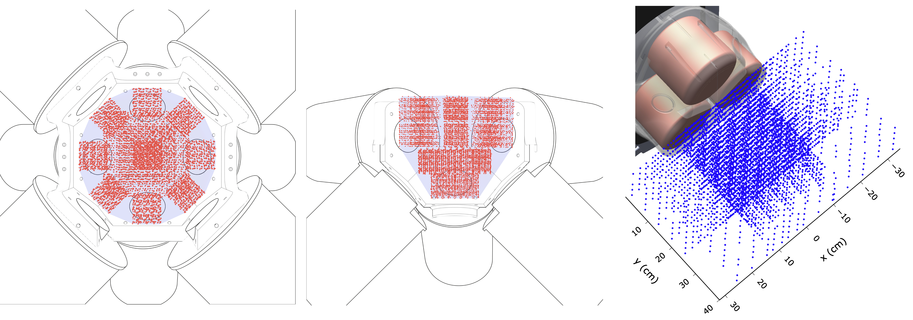

# Structured Learning for Electromagnetic Field Modeling and Real-Time Inversion

<figure>
  
  <figcaption><em>Overview of the OctoMag and Navion datasets.</em></figcaption>
</figure>

---

This repository contains the code accompanying the paper **“Structured Learning for Electromagnetic Field Modeling and Real-Time Inversion”**. In this repo you will find:

- The collected datasets for the OctoMag and Navion Electromagnetic Navigation Systems (eMNS),
- Implementations of the proposed structured learning-based models as well as the benchmark black-box models,
- Trained parameters for all models considered in the paper,
- Notebooks for data processing as well as model training and evaluation.


## Citation

If you use this repository in your research, please cite the accompanying paper:

```bibtex
@article{Bernardes2026StructuredLearning,
  author  = {Bernardes, Antonio and Zughaibi, Jasan and Muehlebach, Michael and Nelson, Bradley J.},
  title   = {Structured Learning for Electromagnetic Field Modeling and Real-Time Inversion},
  journal = {arXiv preprint arXiv:2602.06618},
  year    = {2026},
  url     = {https://arxiv.org/abs/2602.06618}
}
```

## Installation

### Requirements
- **Python 3.8.x** (this codebase is tested/supported on Python 3.8)

Create and activate a Python 3.8 virtual environment, then install dependencies. On a Linux machine:

```bash
python3.8 --version  # should print 3.8.x

python3.8 -m venv magcalibration
source magcalibration/bin/activate

pip install -r requirements.txt
```

## Datasets

The datasets are included in this repository under `data/`:

```text
data/
└── octomag_data/
    └── data/              # OctoMag dataset
└── navion_data/
    └── data/              # Navion dataset
```

You can visualize the datasets using:
```text
notebooks/
├── visualize_octomag.ipynb                 # OctoMag dataset
└── visualize_navion.ipynb                  # Navion dataset
```

## Models

This repository contains implementations and trained parameters for the learning-based models and an interface for the MPEM baseline.

### Model interface
In `notebooks/usage_example.ipynb` you will find a quick demonstration of how to use the considered models through an unified interface.

### Learning-based models

All learning-based model code lives in:

- **Implementation:** `src/calibration/`

Trained parameters for learning-based models:

- **Neural models:** `notebooks/training/params/`
- **Gradient-boosted linear tree regressor:** `notebooks/training/trees/`

### MPEM baseline

For the MPEM (Multipole Expansion Model), the open source implementation is found in:
```text
https://github.com/ethz-msrl/Tesla_core/tree/master/mag_control/mpem
```
And as a Python package (available only for x86 architecture):
```text
https://pypi.org/project/mag-manip/
```

The optimized parameters are found in `mpem/`.

## Workflow

### 1. Data processing

The notebooks in `notebooks/processing/` cover the full preprocessing pipeline:

1. `outliers_in_currents.ipynb`  
   Applies **RANSAC-based** outlier removal.

2. `split_dataset.ipynb`  
   Splits the **cleaned** dataset into train/validation/test sets.

3. `downsample.ipynb`  
   Downsamples the train and validation sets for the data-resolution ablation experiments. In the paper, this is performed only for the OctoMag dataset, with reductions to 50%, 20%, 5%, and 1%.

The notebooks should be run in the order defined in the list above.

### 2. Model training
Each model type has a dedicated training notebook:

1. `train_nn.ipynb`
   For training neural models.

2. `train_gbt.ipynb`
   For training gradient-boosted linear-tree regressors.

3. `train_mpem.ipynb`
   For training MPEM models. Note that this requires a ROS installation and the framework in:
```text
https://github.com/ethz-msrl/Tesla_core/tree/master/mag_control/mpem
```

#### Training with your own dataset

The training (and evaluation) pipelines expect a **pickled** [`pandas.DataFrame`](https://pandas.pydata.org/docs/reference/api/pandas.DataFrame.html) with the following columns:

- **Position:** `x`, `y`, `z`  
  Cartesian coordinates where the magnetic field was measured.
- **Magnetic field:** `Bx`, `By`, `Bz`  
  Measured field vector components at that position.
- **Coil currents:** `em_*`  
  One column per coil. For example, `em_1`, `em_2`, `em_3`, in a 3-coil system.

#### Training with the provided datasets

After running steps `1.` and `2.` of the data-processing pipeline above, the directory `data/octomag_data/split_dataset/` or `data/navion_data/split_dataset/` will contain **pickled** train/validation/test splits of the cleaned dataset of the corresponding eMNS, ready to be used by the training notebooks.

### 3. Model evaluation

To avoid recomputing each model’s magnetic field and gradient predictions for each test/plot, we use the `EvaluationPackage` class (defined in `src/evaluate/`) which stores predictions for a chosen set of models and provides utilities for downstream evaluation.

**Step 1 — Assemble/cached predictions**  
Run `notebooks/testing/assemble_data.ipynb` to build an `EvaluationPackage`.  
This notebook is already configured with the set of models evaluated in the paper.

**NOTE**: This notebook assumes the required downsampled training and validation sets already exist. Therefore, before running it, complete Step 3. (downsample.ipynb) in the data-processing pipeline above for the 50%, 20%, 5%, and 1% reduction settings.

**Step 2 — Use the cached package**  
Once assembled, the `EvaluationPackage` can be loaded by the notebooks in:

- `notebooks/testing/` for quick checks and comparisons
- `notebooks/paper_plots/` to reproduce the figures reported in the paper

### 4. MPEM workspace analysis *(Navion)*
The workspace conditioning analysis was conducted using the notebooks in `notebooks/workspace_analysis/`:
1. `divide_workspace.ipynb` Divides data into cylindrical (or rectangular) segments.
2. `workspace_analysis.ipynb` Runs the workspace analysis required for the plotting in `notebooks/paper_plots/workspace.ipynb`